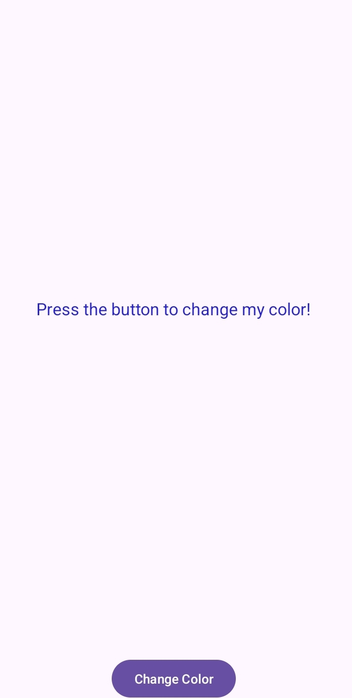
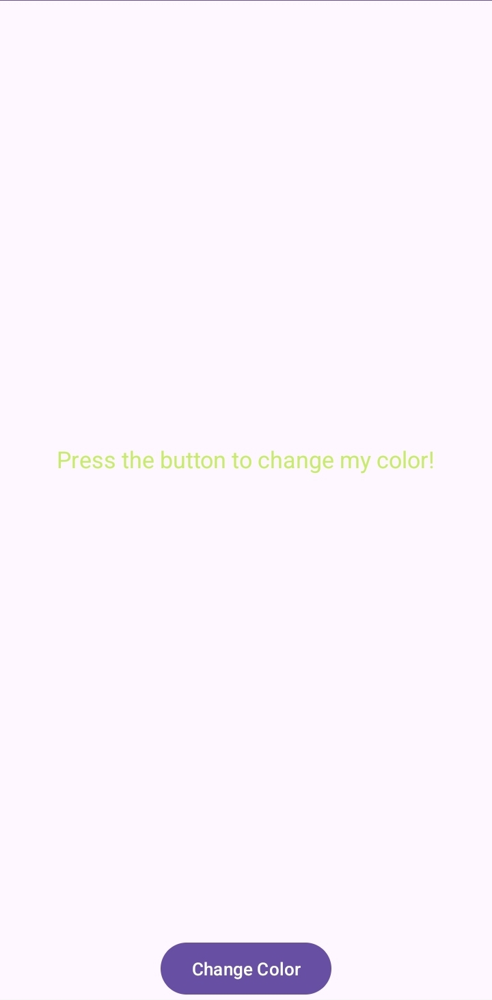

# Text Color Changer Android App

This is a simple Android app built using Java in Android Studio. The app changes the color of the text whenever a button is clicked.

## Features

- **Color Changing Text**: Click the button to change the color of the text.
- **Random Colors**: Each button press applies a random color to the text.
- **Minimal UI**: A straightforward design focused on functionality.

## Screenshots

    



## Installation

1. Clone this repository:
    ```bash
    git clone https://github.com/AdityaSrivastavDS/Text-Colour-Changer-Android-App-
    ```
2. Open the project in Android Studio.
3. Build and run the app on your device or emulator.

## Usage

- Press the button to change the color of the displayed text.
- The text color changes each time you click the button.

## Requirements

- Android Studio
- Android SDK version 23 or higher

## Contributing

If you'd like to contribute by improving the code or adding new features, feel free to open a pull request or submit issues.

## License

This project is licensed under the MIT License. See the [LICENSE](LICENSE) file for details.
